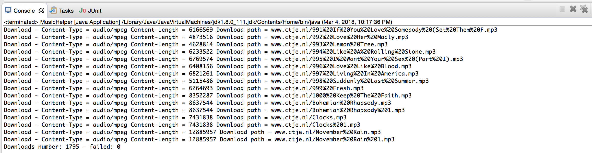

# Audio-File-Downloader

Requirements
------------
- Java v7 or higher
- Shell/git skills to run this app

Usage 
------------
java -jar audio-file-downloader.jar -url http://www.gutenberg.org/files/9147/mp3/ -time_wait 3

 -url <url>               the url to get the files
 
 -time_wait <time_wait>   the time to wait between requests in seconds

Features
------------
Default time_wait is 2 seconds

Default file saving location = subfolder of current location 

Subfolder name will be the name of the hostname of the url 

AFD is compatible with: 
- http://www.gutenberg.org/files/9147/mp3/ or
- normal Apache html index 

Reporting 

Screenshots
------------

TODO List
------------
- [ ] Finish readme

- [ ] Add screenshots of execution

- [x] Report successfull download with file size = 0

- [x] Decode url  

Change log
------------
